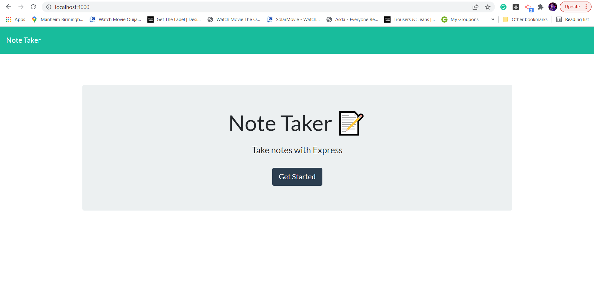
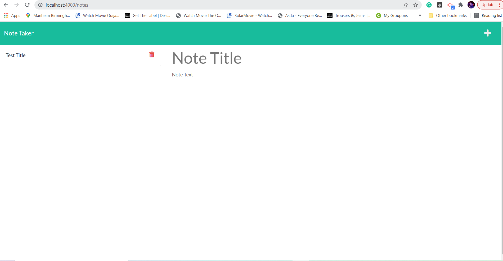
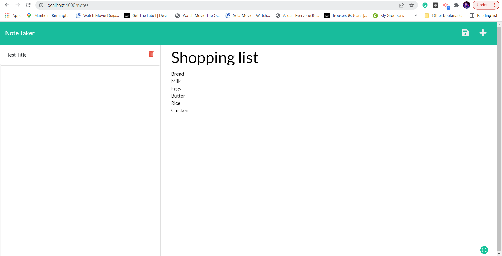
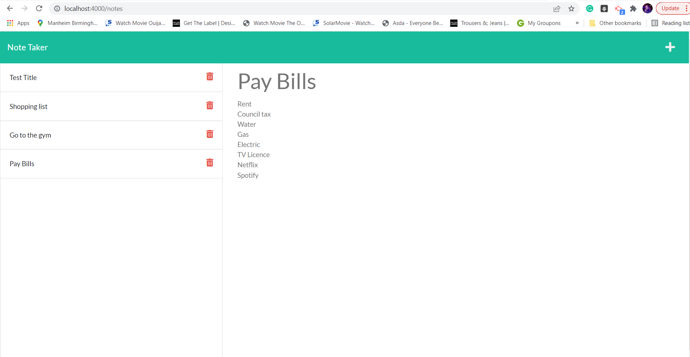
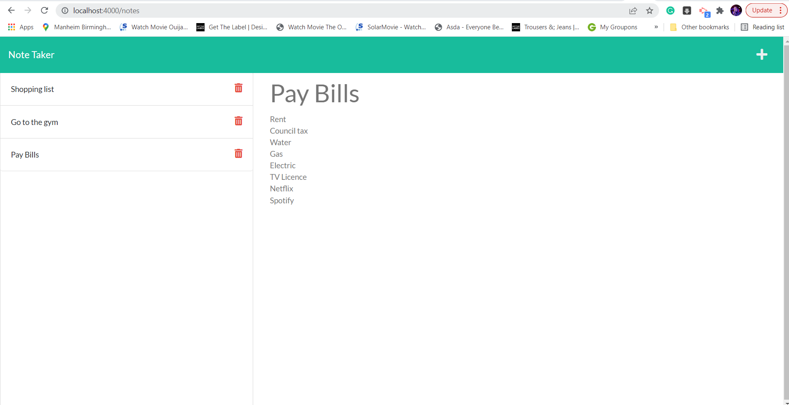

# Note Taker

The application is designed to enable the user to create notes and save notes and delete notes.

## Deployed Github URL

- https://yashemabeth.github.io/note_taker/

## Heroku URL

- https://warm-inlet-03151.herokuapp.com/

## User Story

- As a USER I want to be able to add a note. I will be able to fill out the title and the notes contents the note i WANT to be created.for the notes to be created.
- In order to ADD the note I will click on the Save Icon then the note will be saved in the saved notes section.
- As a user I want to delete a note I have saved. In order to delete a note I will go the saved notes section and click on the delete Icon to delete note.

## Installation

- Open the terminal in VS Code and type npm run dev

## Technologies Used

- express
- nodemon

## Screenshots

Homepage

Notes Page

Creating Notes

Saved Notes

Delete Notes

